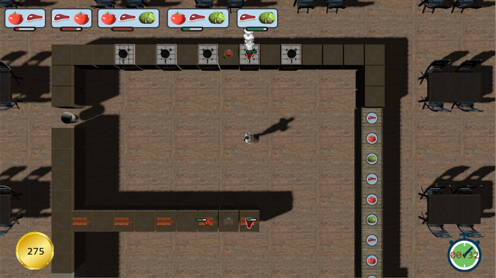

# Overcooked
This project was made as an exam project for a module called Graphics Programming 2.

# Overlord
The engine is based on the Overlord engine and [PhysX](https://gameworksdocs.nvidia.com/PhysX/4.0/documentation/PhysXGuide/Index.html). I extended it with features like:
* [Skinning](OverlordEngine/MeshFilter.h)
* [Particle effects](OverlordEngine/ParticleEmitterComponent.h)
* [Shadow mapping](OverlordEngine/ShadowMapRenderer.h)
* [Multiple materials](OverlordProject/Materials) using different [effect files](OverlordProject/Resources/Effects)
* ...

